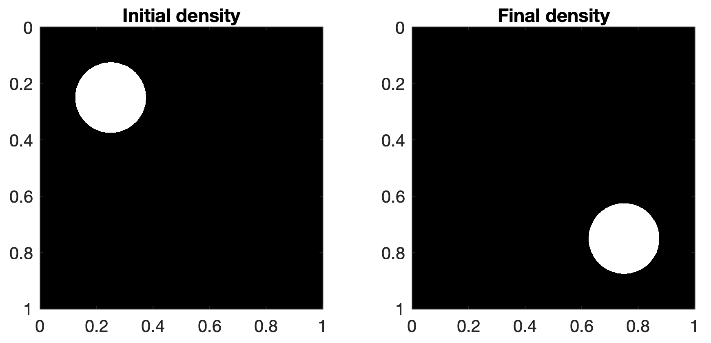
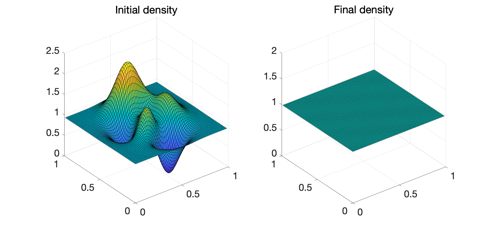
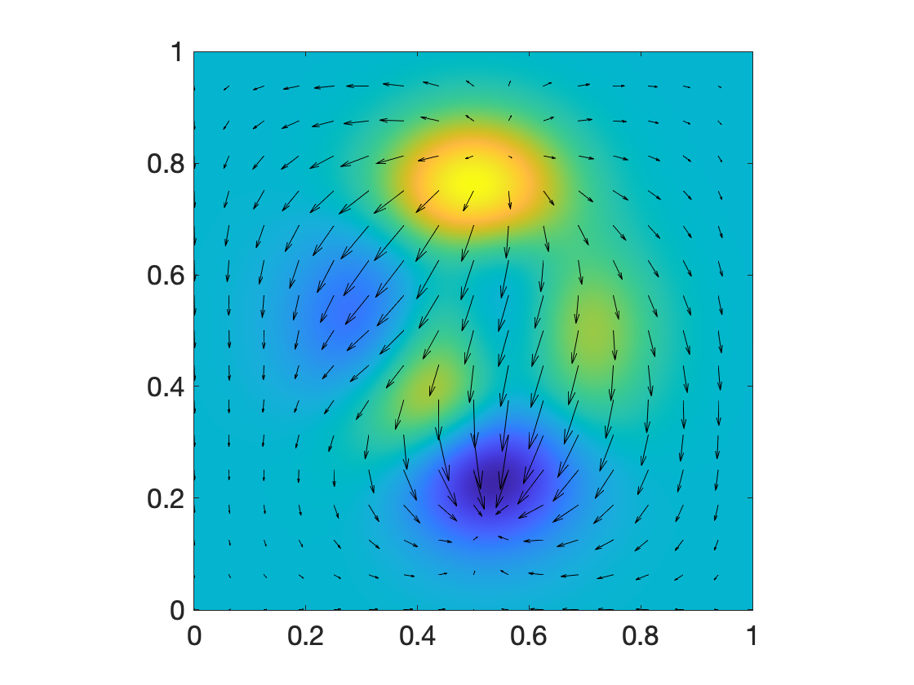

# The back-and-forth method

This page provides documentation for the source code used in the paper [A fast approach to optimal transport: The back-and-forth method](https://arxiv.org/pdf/1905.12154.pdf) [1]. The original code was written in C and we provide here a MATLAB wrapper to the C code.


# Introduction


We are interested in the optimal transport problem


<!-- $$
\displaystyle \frac 1 2 W_{\!2}^2(\mu,\!\nu)=\min_{T_{\#}\mu=\nu} \int_{\Omega} \frac 1 2 \lVert T(x)-x\rVert^2 \,\mu(x)dx,
$$ --> 

<div align="center"></div>


on the unit square <!-- $\Omega=[0,1]^2$ --> . Here <!-- $\mu$ -->  and <!-- $\nu$ -->  are two densities on <!-- $\Omega$ --> , and  <!-- $\lVert x-y\rVert^2=(x_1-y_1)^2+(x_2-y_2)^2$ --> . 


The code solves the dual Kantorovich problem
<!-- $$
\max_{\phi,\psi} \int_{\Omega} \phi(y)\,\nu(y)dy + \int_{\Omega} \psi(x)\,\mu(x)dx,
$$ --> 

<div align="center"></div>

over functions <!-- $\phi,\psi\colon\Omega\to\mathbb{R}$ -->  satisfying the constraints


<!-- $$
\displaystyle \phi(y)+\psi(x)\le \frac 1 2 \lVert x-y\rVert^2
$$ --> 

<div align="center"></div>

# Installation


Requirements: FFTW ([download here](http://www.fftw.org/)), MATLAB.

Download the C MEX file `w2.c` [here](lalala) or by cloning the GitHub repository.

Compile it: in a MATLAB session run
```matlab
mex -O CFLAGS="\$CFLAGS -std=c99" -lfftw3 -lm w2.c 
```
This will produce a MEX function that you can use in MATLAB. You may need to use `-I` and `-L` to link to the FFTW3 library. See [this page](https://www.mathworks.com/help/matlab/matlab_external/build-an-executable-mex-file.html) for more information on how to compile MEX files. 


# Usage

In a MATLAB session, run the command
```matlab
[phi, psi] = w2(mu, nu, numIters, sigma);
```

Input:

* `mu` and `nu` are two <!-- $N\times M$ -->  arrays of nonnegative values which sum up to the same value.
* `numIters` is the total number of iterations.
* `sigma` is the initial step size of the gradient ascent iterations.

Output:

* `phi` and `psi` are <!-- $N\times M$ -->  arrays corresponding to the Kantorovich potentials <!-- $\phi$ -->  and <!-- $\psi$ --> . 


Example 1
=========
Let us first compute the optimal transport between the characteristic function of a disk and its translate. We discretize the problem with ~1 million points (<!-- $1024\times 1024$ --> ).

```matlab
n = 1024;

[x, y] = meshgrid(linspace(0.5/n, 1-0.5/n, n));

mu = zeros(n);
idx = (x-0.25).^2 + (y-0.25).^2 < 0.125^2;
mu(idx) = 1;
mu = mu * n^2/sum(mu(:));

nu = zeros(n);
idx = (x-0.75).^2 + (y-0.75).^2 < 0.125^2;
nu(idx) = 1;
nu = nu * n^2/sum(nu(:));

subplot(1,2,1)
imagesc(mu, 'x',[0,1], 'y',[0,1]);
title('Initial density')

subplot(1,2,2)
imagesc(nu, 'x',[0,1], 'y',[0,1]);
title('Final density')    
```



	

Here the densities are renormalized so that 
<!-- $$
\displaystyle \int_\Omega\mu(x)dx=\int_\Omega\nu(x)dx=1.
$$ --> 

<div align="center"></div> 

Note that <!-- $\nu$ -->   is the translate of <!-- $\mu$ -->  by the vector <!-- $(1/2, 1/2)$ --> , and therefore 

<!-- $$
\displaystyle\frac 1 2 W_{\!2}^2(\mu,\!\nu)=\frac 1 4.
$$ --> 

<div align="center"></div>

```matlab
numIters = 10;
sigma = 8.0 / max(max(mu(:)), max(nu(:)));

tic;
[phi, psi] = w2(mu, nu, numIters, sigma);
toc
```

Output:

	FFT setup time: 0.01s
	iter  0, W2 value: 2.414694e-01
	iter  5, W2 value: 2.500000e-01
	iter 10, W2 value: 2.500000e-01
	Elapsed time is 3.432973 seconds.


# Example 2

Let's compute the optimal transport between the MATLAB `peaks` function and the uniform measure, on the 2d domain <!-- $[0,1]^2$ --> .

We discretize the problem with ~1 million points (<!-- $1024\times 1024$ --> ) and plot the densities.

```matlab
n = 1024;

[x, y] = meshgrid(linspace(0,1,n));

mu = peaks(n);
mu = mu - min(mu(:));
mu = mu * n^2/sum(mu(:));

nu = ones(n);

s = 16;     % plotting stride
subplot(1,2,1);
surf(x(1:s:end,1:s:end), y(1:s:end,1:s:end), mu(1:s:end,1:s:end))
title('Initial density')

subplot(1,2,2);
surf(x(1:s:end,1:s:end), y(1:s:end,1:s:end), nu(1:s:end,1:s:end))
title('Final density')
```
	


Then run the back-and-forth solver:

```matlab
numIters = 20;
sigma = 8.0 / max(max(mu(:)), max(nu(:)));

tic;
[phi, psi] = w2(mu, nu, numIters, sigma);
toc
```
Output:

	FFT setup time: 0.02s
	iter  0, W2 value: -1.838164e-02
	iter  5, W2 value: 9.791770e-04
	iter 10, W2 value: 9.793307e-04
	iter 15, W2 value: 9.793364e-04
	iter 20, W2 value: 9.793362e-04
	Elapsed time is 10.016858 seconds.

Finally consider the optimal transport map 

<!-- $$
T(x)=x-\nabla\psi(x)
$$ --> 

<div align="center"></div>

and display the displacement <!-- $m=-\nabla\psi$ -->  as a vector field.

```matlab
[mx, my] = gradient(-psi, 1/n);

figure;
imagesc(mu,'x',[0,1],'y',[0,1]);
axis square
set(gca,'YDir','normal')

hold on
s = 64;
quiver(x(1:s:end,1:s:end), y(1:s:end,1:s:end), ...
       mx(1:s:end,1:s:end), my(1:s:end,1:s:end), ...
       0, 'Color','k');
```





# References


[1] Matt Jacobs and Flavien Léger. [A fast approach to optimal transport: The back-and-forth method](https://arxiv.org/pdf/1905.12154.pdf). *Numerische Mathematik* (2020): 1-32.


